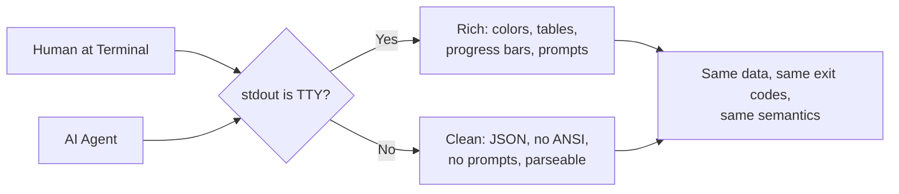
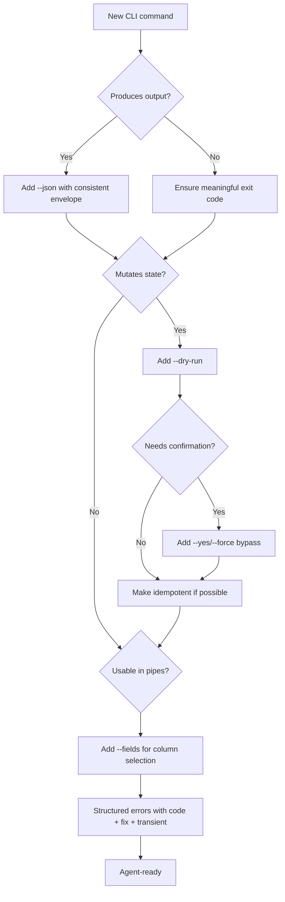

# Better CLI: Build CLIs for Humans and AI Agents

Build command-line tools that are delightful for humans at a terminal AND reliable for AI agents in automation pipelines. These goals are orthogonal, not conflicting.

This skill targets **command-based CLIs** (think `git`, `docker`, `gh`, `kubectl`) — tools with subcommands, flags, and structured output. It is not about full-screen TUI applications or interactive dashboards.

## When to Use

- Building a new CLI tool in any language
- Improving or refactoring an existing CLI to be more human- and agent-friendly
- Adding commands, flags, or output formats to an existing CLI
- Reviewing CLI code for usability, composability, or agent-readiness

NOT for: TUI/full-screen terminal apps, GUI applications, REST/GraphQL API design, shell scripting

## Core Philosophy

> Human DX optimizes for discoverability and forgiveness. Agent DX optimizes for predictability and defense-in-depth. A great CLI does both.

**The Golden Rule: Output that tells you what to do next.** Every command's output — success or failure — should give the user (human or AI agent) enough context to know what their next action should be. An agent reading your CLI's output should be able to continue its workflow without guessing.



## The Rules (Priority Order)

### P0: Critical — Every CLI Must Do These

#### 1. stdout for data, stderr for everything else

```
stdout  ->  primary output (results, JSON, file contents) — for piping
stderr  ->  errors, warnings, progress, diagnostics, prompts — for humans
```

This is the single most important rule. It enables piping, redirection, and agent parsing. Never mix.

#### 2. Exit 0 on success, non-zero on failure

Use semantic exit codes so scripts and agents can branch on failure type:

| Code | Meaning | When to Use |
|------|---------|-------------|
| 0 | Success | Operation completed |
| 1 | General failure | Catch-all error |
| 2 | Usage error | Bad arguments, unknown flags |
| 3 | Resource not found | File, user, service missing |
| 4 | Permission denied | Auth failure, insufficient rights |
| 5 | Conflict | Resource already exists |
| 75 | Temporary failure | Network timeout — retry may help |
| 78 | Configuration error | Missing or invalid config |

Document your exit codes. The `transient` distinction (75 vs others) is critical — agents use it to decide whether to retry.

#### 3. Support `--json` for structured output

Every command that produces output MUST support `--json` (or `--output json`). Use a consistent envelope:

```json
{
  "status": "ok",
  "data": { "id": "abc-123", "name": "my-resource" },
  "warnings": []
}
```

Same shape for every command. Agents parse it once, use it everywhere. Treat this as a versioned API contract — adding optional fields is safe; removing or renaming fields is a breaking change.

#### 4. Output must guide the next action

This is the key to making CLIs work for AI agents. Every command output should be **interpretable and navigable** — the reader should know what to do next without guessing.

**On success** — confirm what happened and suggest next steps:
```
Created deployment 'web-app' (ID: deploy-xyz)

Next steps:
  View logs:      mycli logs deploy-xyz
  Check status:   mycli status deploy-xyz
```

**On failure** — explain what went wrong and how to fix it:
```
Error: Cannot deploy — 2 failing health checks.

Fix: mycli health check web-app --verbose
     mycli deploy --env staging --force   (skip health checks)
```

**On partial results** — indicate what's missing and how to get more:
```
Showing 20 of 142 results. Next page: mycli list --cursor eyJpZCI6IDIwfQ==
```

This pattern is what makes an agent autonomous — it reads the output, sees the suggested command, and executes it. Without this, agents stall or hallucinate next steps.

#### 5. Support `--help` and `--version`

`--help` must include: description, usage pattern, flag list with types and defaults, and 2-3 realistic examples. Examples are the most-read section — lead with them.

```
EXAMPLES
  $ mycli deploy --env staging          Deploy to staging
  $ mycli deploy --env prod --dry-run   Preview production deployment
  $ mycli deploy --env prod --yes       Deploy without confirmation
```

#### 6. Never require interactive input

Every interactive prompt MUST have a flag equivalent. If stdin is not a TTY, never prompt — fail with a clear error or use defaults.

| Prompt Type | Flag Equivalent |
|-------------|-----------------|
| Confirmation | `--yes` / `--force` |
| Selection | `--type=value` |
| Text input | `--name=value` |
| Password | `--password-file=path` or stdin pipe |

An agent cannot type 'y' at a prompt. If your CLI hangs waiting for input, the agent's workflow is dead.

### P1: High — What Separates Good from Great

#### 7. Detect TTY and adapt

When stdout IS a TTY: colors, tables, progress bars, interactive prompts.
When stdout is NOT a TTY: plain text, no ANSI codes, no spinners, no prompts.

Respect these environment signals:

| Signal | Meaning |
|--------|---------|
| `NO_COLOR` (any non-empty value) | Suppress ANSI color |
| `TERM=dumb` | Minimal terminal — no formatting |
| `CI=true` | Running in CI — no interactive features |
| `MYCLI_NO_INPUT=1` | App-specific non-interactive override |

#### 8. Errors must be actionable

Every error needs four components:

1. **What** went wrong — the error itself
2. **Context** — which resource, which operation, what input
3. **Fix** — the exact command or action to resolve it
4. **Reference** — docs URL or `mycli help <topic>`

Bad: `Error: EACCES`
Good: `Error: Cannot write to /etc/config — permission denied. Try: sudo mycli config set key=value`

When `--json` is active, errors MUST be structured:

```json
{
  "status": "error",
  "error": {
    "code": "AUTH_EXPIRED",
    "message": "API token has expired",
    "fix": "Run: mycli auth login --refresh",
    "transient": false
  }
}
```

The `code` field is machine-readable (agents branch on it). The `transient` field tells agents whether to retry.

#### 9. Configuration precedence

Always: **flags > env vars > project config > user config > defaults**

| Layer | Example | Use Case |
|-------|---------|----------|
| Flags | `--port 8080` | One-off override |
| Env vars | `MYCLI_PORT=8080` | CI/CD, containers |
| Project config | `.mycli.yaml` in repo root | Team-shared settings |
| User config | `~/.config/mycli/config.yaml` | Personal defaults |
| Defaults | Hardcoded | Sensible out-of-box |

Never accept secrets via flags — they leak to `ps` output and shell history. Use env vars, config files, or `--password-file`.

#### 10. Design for pipes and composition

- Support `--fields name,status,id` to limit output columns (token efficiency for agents)
- Support reading from stdin: `cat ids.txt | mycli get --stdin`
- Use NDJSON (one JSON object per line) for streaming/paginated data
- When creating resources, output the identifier so subsequent commands can chain

```bash
# This pipeline must work
mycli create --json | jq -r '.data.id' | xargs mycli deploy --id
```

#### 11. Never break the existing contract

When improving an existing CLI, treat its current behavior as a contract. Users and scripts depend on it.

**Breaking changes (NEVER do without a major version bump):**
- Removing or renaming flags, subcommands, or env vars
- Changing exit codes for existing failure modes
- Removing or renaming fields in `--json` output
- Changing default behavior of existing commands
- Changing positional argument order or meaning

**Safe, additive changes (always OK):**
- Adding new flags with defaults that preserve old behavior
- Adding new optional fields to JSON output
- Adding new subcommands
- Adding `--json` support where it didn't exist
- Adding new exit codes for cases that previously returned 1
- Adding `--fields`, `--quiet`, `--dry-run` as new flags

When in doubt, **add, don't modify**. Deprecate old behavior with warnings on stderr before removing it.

#### 12. Flags over positional arguments

Flags are self-documenting, order-independent, and future-proof.

Bad: `mycli deploy production v2.1.0`
Good: `mycli deploy --env production --version v2.1.0`

One positional argument is fine (the "main thing" — file path, resource name). Two is suspicious. Three is wrong.

### P2: Medium — Polish That Builds Trust

#### 13. Show progress on stderr for long operations

For TTY: spinners, progress bars, ETA.
For pipes: suppress entirely, or emit structured progress to stderr.
Never send progress indicators to stdout — they corrupt data streams.

#### 14. Support `--dry-run` for mutating commands

Show exactly what would change without doing it. With `--json`, output planned changes in structured format. This is an essential safety rail for AI agents — they can validate before executing.

#### 15. Make operations idempotent

`mycli config set key=value` must be safe to run twice. Create commands should support `--if-not-exists`. Agents retry on transient failures — design for it.

#### 16. Provide shell completions

Support bash, zsh, and fish via `mycli completions <shell>`. Most frameworks generate these automatically (Cobra, Click, oclif, clap).

#### 17. Use consistent command grammar

Pick a pattern and stick to it across every command:

- Noun-verb: `mycli pod list`, `mycli pod delete` (kubectl style)
- Verb-noun: `mycli list pods`, `mycli delete pod` (docker style)

Standardize on common verbs: `list`, `get`/`show`, `create`, `update`, `delete`.

## Agent-Readiness Decision Tree

When reviewing or building a CLI, walk through this:



## Anti-Patterns

### Mixing data and diagnostics on stdout
**Novice**: "Print everything to stdout, users will see it"
**Expert**: `mycli list | jq .` breaks if warnings are on stdout. Data to stdout. Everything else to stderr. No exceptions.
**Timeline**: Unix convention since 1977. Still the #1 mistake in new CLIs.

### Colors and ANSI in piped output
**Novice**: "Always show colors for better UX"
**Expert**: ANSI escape sequences (`\x1b[38;2;...m`) are tokenized as text by LLMs, wasting context window and breaking parsing. Check `isatty(stdout)` and `NO_COLOR` before emitting any ANSI codes.
**Detection**: Pipe output through `cat -v` — if you see `^[[` sequences, you have a bug.

### Interactive prompts with no bypass
**Novice**: "Always confirm destructive operations for safety"
**Expert**: Agents can't type 'y'. Every prompt MUST have a `--yes`/`--force` bypass. If stdin is not a TTY and no bypass flag is provided, fail with a clear error — never hang.
**Detection**: Command hangs when run in CI or with stdin piped from `/dev/null`.

### Printing nothing on success
**Novice**: "Unix tradition says silence means success"
**Expert**: For humans, silence feels broken — show brief confirmation ("Created resource abc123"). For agents, silence is ambiguous — exit 0 and support `--json` to return the result. Use `-q`/`--quiet` for scripts that explicitly want silence.

### Designing for humans OR machines, not both
**Novice**: "Our users are developers, they'll parse text" or "Just output JSON always"
**Expert**: Detect context (TTY vs pipe) and adapt automatically. Human-readable by default in terminals, machine-readable when piped or when `--json` is passed. Both audiences are served by the same command.

### Output that doesn't tell you what to do next
**Novice**: "Just print the result and exit"
**Expert**: Every output is a signpost. On success, suggest the logical next command. On failure, suggest the fix command. On partial results, show how to get more. Agents depend on these cues to continue autonomously — without them, agents stall, retry blindly, or hallucinate commands.
**Detection**: Run a command successfully and ask: "Does the output tell me what to do next?" If not, add a "Next steps" section.

### Breaking existing CLI contracts while "improving" them
**Novice**: "This flag name is bad, let me rename it" or "Let me restructure the JSON output to be cleaner"
**Expert**: Existing users and scripts depend on the current contract — flag names, exit codes, output shape, default behavior. Add new capabilities alongside the old ones. Deprecate with stderr warnings before removing. Renaming a flag or removing a JSON field can break thousands of downstream scripts and agent workflows.
**Detection**: Any PR that removes, renames, or changes the type of an existing flag, exit code, or output field without a major version bump.

### Verbose default output that wastes agent context
**Novice**: "More information is always better"
**Expert**: A single `vitest` run generates 419KB of output. An agent needs 5 numbers. Support `--fields` to select columns, `--quiet` for minimal output, and `--json` for structured data. Every unnecessary byte in stdout costs the agent tokens.

## Agent-Readiness Checklist

Quick audit for any CLI:

```
[ ] Every command supports --json with consistent envelope
[ ] stdout has ONLY data; stderr has everything else
[ ] Exit codes are semantic (not just 0/1)
[ ] Every prompt has a --yes / --force / --flag bypass
[ ] Errors include: code, message, fix suggestion, transient flag
[ ] --dry-run available for all mutating commands
[ ] Progress/spinners go to stderr, never stdout
[ ] NO_COLOR and TTY detection implemented
[ ] --fields flag limits output to requested columns
[ ] Create commands output the created resource identifier
[ ] Mutating commands are idempotent or have --if-not-exists
[ ] --help includes examples, not just flag descriptions
[ ] Secrets never accepted via flags (use env vars or files)
[ ] Piped output contains zero ANSI escape codes
[ ] Success output includes "next steps" with exact follow-up commands
[ ] Error output includes the exact command to fix or diagnose the issue
[ ] No debug traces or stack traces in default output (use --debug)
[ ] Existing flags, exit codes, and output fields are never removed or renamed (additive only)
```

## References

Consult these for deep dives — they are NOT loaded by default:

| File | Consult When |
|------|-------------|
| `references/output-design.md` | Designing JSON envelopes, NDJSON streaming, field selection, output versioning, token-efficient formats |
| `references/agent-patterns.md` | Understanding how AI agents consume CLIs, MCP wrapping, schema introspection, dynamic tool discovery |
| `references/error-handling.md` | Full exit code tables (sysexits.h), structured error format specs, error taxonomy design |
| `references/interactivity.md` | TTY detection code samples (Node/Python/Go/Rust), NO_COLOR implementation, progress bar patterns, prompt design |
| `references/composability.md` | Pipe-friendly patterns, stdin conventions, cross-command chaining, NDJSON streaming |
| `references/discoverability.md` | Help text structure, shell completion generation, man pages, `--help-json` for agent introspection |
| `references/security.md` | Secret handling, input validation for agent contexts (path traversal, injection), permission scoping |
| `references/testing.md` | Output contract testing, CLI integration test patterns, snapshot testing, schema validation in CI |
