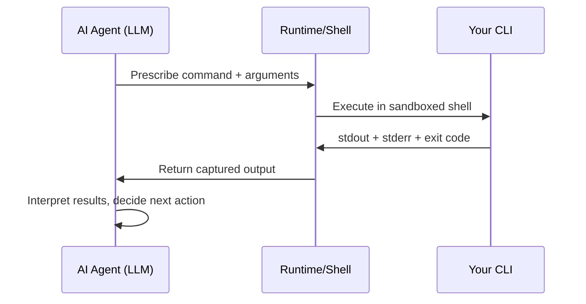

# Agent Patterns

How AI agents actually consume CLIs, and how to design for them.

## How Agents Execute CLI Commands

All CLI agents (Claude Code, Codex CLI, Gemini CLI, SWE-Agent, Copilot CLI) follow the same core loop:



The LLM never executes commands directly. It prescribes what to run, receives the output as text, and reasons about what to do next. This means:

1. **Output is consumed as tokens** — every byte costs context window
2. **Agents can't interact** — no prompts, no pagers, no confirmations
3. **Exit codes are the primary signal** — agents check exit code before parsing output
4. **stderr and stdout may be combined** — some runtimes merge them (Claude Code's bash tool combines stdout+stderr)
5. **Large output is truncated** — runtimes impose limits (often ~100KB)

## What Agents Need from Your CLI

### 1. Parseable, Deterministic Output

Agents need to extract specific values from command output. This fails when:
- Output format varies between runs (non-deterministic ordering)
- Values are embedded in prose ("The deployment was created with ID abc-123")
- Tables use inconsistent spacing or alignment
- ANSI escape codes pollute the output

What works:
```json
{"status": "ok", "data": {"id": "abc-123"}}
```

### 2. Actionable Error Information

When a command fails, agents need three things:
1. **What went wrong** (error code for branching)
2. **Is it transient?** (should I retry?)
3. **What should I do instead?** (suggested fix command)

```json
{
  "status": "error",
  "error": {
    "code": "QUOTA_EXCEEDED",
    "message": "Storage quota exceeded (95/100 GB used)",
    "fix": "Delete old deployments: mycli deployments prune --older-than 30d",
    "transient": false
  }
}
```

### 3. Next-Step Guidance

After successful operations, tell the agent (and human) what to do next:

```
Created deployment 'web-app' (ID: deploy-xyz)

Next steps:
  View logs:    mycli logs deploy-xyz
  Check status: mycli status deploy-xyz
  Open in browser: mycli open deploy-xyz
```

Agents parse these suggestions to determine their next command. This is one of the most impactful patterns for agentic workflows.

### 4. Minimal Output by Default

A real benchmark: one `vitest` run produced 419KB of terminal output. The agent needed 5 numbers (pass count, fail count, skip count, duration, exit code). It took 12 tool calls and re-ran the entire test suite 5-6 times trying to extract the answer.

Fix: `vitest --reporter=json | jq '{pass: .numPassedTests, fail: .numFailedTests}'`

Your CLI should support:
- `--quiet` / `-q` for minimal output
- `--fields` to select specific columns
- `--json --fields` for targeted structured output
- `--summary` for aggregated results instead of full detail

### 5. Non-Interactive Operation

Agents cannot:
- Type 'y' at confirmation prompts
- Navigate interactive pagers (less, more)
- Select from interactive menus
- Enter passwords at prompts

Your CLI must support:
- `--yes` / `--force` to bypass all confirmations
- `--no-pager` to disable pagers (or auto-detect non-TTY)
- `--no-input` / `--non-interactive` to fail instead of prompting
- `--password-file` or stdin for secrets

## Schema Introspection

Help agents discover your CLI's capabilities programmatically.

### Pattern 1: --help (Universal)

All agents parse `--help`. Make it excellent:

```
USAGE
  mycli deploy [flags]

DESCRIPTION
  Deploy the application to the specified environment.

FLAGS
  --env string       Target environment (required) [staging|production]
  --version string   Version to deploy (default: latest)
  --dry-run          Preview changes without deploying
  --yes              Skip confirmation prompt
  --json             Output results as JSON

EXAMPLES
  $ mycli deploy --env staging
  $ mycli deploy --env production --dry-run --json
  $ mycli deploy --env production --version v2.1.0 --yes
```

Key elements agents rely on:
- Flag types and allowed values (`string`, `[staging|production]`)
- Which flags are required vs optional
- Default values
- Examples showing real flag combinations

### Pattern 2: --help-json (Emerging)

Expose command metadata as JSON for programmatic discovery:

```bash
mycli deploy --help-json
```

```json
{
  "command": "deploy",
  "description": "Deploy the application to the specified environment",
  "flags": {
    "env": {"type": "string", "required": true, "enum": ["staging", "production"]},
    "version": {"type": "string", "default": "latest"},
    "dry-run": {"type": "boolean", "default": false},
    "yes": {"type": "boolean", "default": false},
    "json": {"type": "boolean", "default": false}
  },
  "examples": [
    "mycli deploy --env staging",
    "mycli deploy --env production --dry-run --json"
  ]
}
```

### Pattern 3: Schema Command

For complex CLIs, expose full schemas:

```bash
mycli schema deploy          # JSON Schema for deploy command
mycli schema --list          # List all available commands
mycli schema deploy --output # Schema for deploy's output format
```

## MCP (Model Context Protocol) Wrapping

CLIs can be exposed as MCP tools for structured agent consumption:

```json
{
  "name": "mycli_deploy",
  "description": "Deploy application to environment",
  "inputSchema": {
    "type": "object",
    "properties": {
      "env": {"type": "string", "enum": ["staging", "production"]},
      "version": {"type": "string", "default": "latest"},
      "dry_run": {"type": "boolean", "default": false}
    },
    "required": ["env"]
  }
}
```

This transforms your CLI into a structured tool that agents invoke with validated parameters instead of constructing shell commands.

### When to Add MCP Support

- Your CLI has >10 commands (worth the wrapper investment)
- Agents are a primary consumer (not just occasional use)
- You want typed parameters instead of string flag parsing
- You need to support multiple agent platforms (Claude, Copilot, Gemini)

## Token Efficiency

Every token in CLI output costs the agent context window and API spend.

### Token Cost of Common Patterns

| Pattern | Tokens | Impact |
|---------|--------|--------|
| Full `--help` output | ~200-500 | Acceptable (one-time discovery) |
| JSON with all fields | ~500-5000 | Often wasteful — use `--fields` |
| Verbose error with traceback | ~200-1000 | OK on failure — agent needs to diagnose |
| Progress bar output (ANSI) | ~100-500 per update | Pure waste — suppress in non-TTY |
| Color-formatted table | ~2x plain text | Pure waste — adds zero information for agents |
| Streaming logs (unbounded) | Unbounded | Dangerous — always support `--limit` or `--since` |

### Cost Reduction Strategies

1. **Support `--fields`**: 50-field object vs 3-field selection = 10-20x token reduction
2. **Support `--quiet`**: Output only the essential value (ID, status, URL)
3. **Suppress ANSI**: Check TTY before emitting any escape codes
4. **Paginate by default**: `--limit 20` unless explicitly asked for more
5. **Summary modes**: `--summary` for aggregated results vs full detail

## Agent Safety Patterns

### Dry Run for Validation

Agents should preview changes before executing:

```bash
mycli deploy --env production --dry-run --json
```

```json
{
  "status": "ok",
  "dry_run": true,
  "changes": [
    {"action": "update", "resource": "deployment/web-app", "field": "image", "from": "v2.0", "to": "v2.1"},
    {"action": "restart", "resource": "pod/web-app-1"},
    {"action": "restart", "resource": "pod/web-app-2"}
  ]
}
```

### Input Validation

Agents generate three failure modes humans rarely produce:
- **Path traversals**: `../../.ssh/id_rsa` as resource names
- **Control characters**: ASCII < 0x20 in string inputs
- **Injection**: Embedded shell metacharacters in arguments

Validate inputs defensively. The agent is not a trusted operator.

### Idempotency for Retry Safety

Agents retry on transient failures. If your create command fails midway and the agent retries:
- With idempotency: succeeds (recognizes resource exists)
- Without idempotency: fails with "already exists" error

Support `--if-not-exists` for creates, and design updates to be naturally idempotent.
