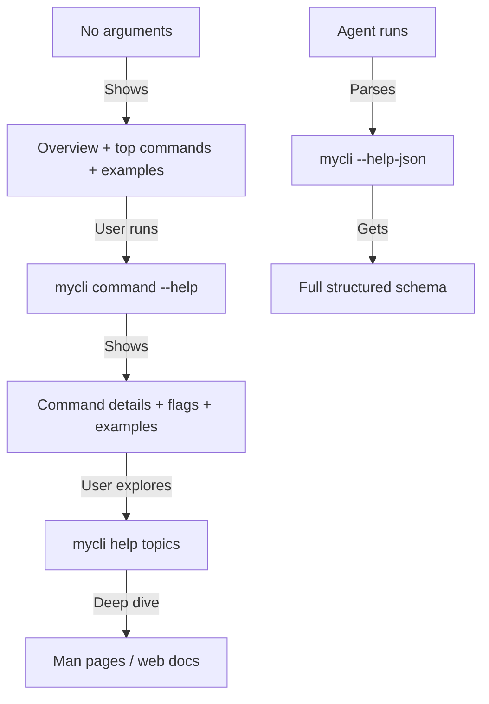

# Discoverability

Help text, shell completions, man pages, and schema introspection for humans and agents.

## Help Text Design

### Top-Level Help (no arguments or `--help`)

When a user runs your CLI with no arguments, show a concise overview:

```
mycli - Manage deployments and infrastructure

USAGE
  mycli <command> [flags]

COMMANDS
  deploy      Deploy application to an environment
  status      Check deployment status
  logs        View application logs
  config      Manage configuration
  auth        Authenticate with the service

FLAGS
  --help       Show help
  --version    Show version
  --json       Output as JSON (available on all commands)

EXAMPLES
  $ mycli deploy --env staging
  $ mycli status --json
  $ mycli logs --follow

Run 'mycli <command> --help' for details on a specific command.
```

### Command-Level Help (`mycli deploy --help`)

```
Deploy application to an environment.

Builds the application, runs pre-deployment checks, and deploys to
the specified environment. Use --dry-run to preview changes first.

USAGE
  mycli deploy [flags]

FLAGS
  --env string       Target environment (required) [staging|production]
  --version string   Version to deploy (default: "latest")
  --dry-run          Preview changes without deploying
  --yes              Skip confirmation prompt
  --json             Output as JSON
  --fields strings   Comma-separated list of output fields
  --timeout duration Deployment timeout (default: "5m")

EXAMPLES
  $ mycli deploy --env staging
  $ mycli deploy --env production --dry-run --json
  $ mycli deploy --env production --version v2.1.0 --yes

EXIT CODES
  0   Success
  1   Deployment failed
  2   Invalid arguments
  4   Permission denied
  75  Temporary failure (retry may help)

SEE ALSO
  mycli status    Check deployment status after deploying
  mycli logs      View deployment logs
  mycli rollback  Revert to previous deployment
```

### Help Text Rules

1. **Lead with examples** — most-read section, most useful for both humans and agents
2. **Show flag types and defaults**: `--timeout duration (default: "5m")` not just `--timeout`
3. **Show allowed values**: `--env string [staging|production]` when the set is finite
4. **Mark required flags**: `(required)` or asterisk
5. **Include exit codes** — agents use these to branch on failures
6. **Include SEE ALSO** — helps discovery of related commands
7. **No walls of text** — concise descriptions, then details in man pages or docs

### Error-Triggered Help

When a command is used incorrectly, show targeted help:

```
Error: missing required flag --env

Usage: mycli deploy --env <staging|production> [flags]

Run 'mycli deploy --help' for full details.
```

For typos, suggest corrections:

```
Error: unknown command "deplooy"

Did you mean?
  deploy    Deploy application to an environment

Run 'mycli --help' for all commands.
```

## Shell Completions

### Generating Completions

Most frameworks generate completions automatically:

| Framework | Command |
|-----------|---------|
| Cobra (Go) | `mycli completion bash/zsh/fish` |
| Click (Python) | `_MYCLI_COMPLETE=bash_source mycli` |
| clap (Rust) | Built-in with `clap_complete` crate |
| oclif (Node) | `mycli autocomplete bash/zsh` |
| Commander.js | Third-party: `omelette` or `tabtab` |
| Typer (Python) | `mycli --install-completion` |

### Installation Pattern

Provide a self-installing command:

```bash
# Generate and install completions
mycli completions install

# Or generate to stdout for manual installation
mycli completions bash >> ~/.bashrc
mycli completions zsh >> ~/.zshrc
mycli completions fish > ~/.config/fish/completions/mycli.fish
```

### Dynamic Completions

For flags with dynamic values (environments, resource names), register dynamic completion handlers:

```bash
# Typing: mycli deploy --env <TAB>
# Should complete with: staging  production  development

# Typing: mycli logs --name <TAB>
# Should complete with actual resource names from API
```

## Man Pages

### Generating Man Pages

Most Go/Rust frameworks generate man pages from code. For other languages:

```bash
# From Markdown
pandoc docs/mycli.1.md -s -t man -o mycli.1

# Install
install -m 644 mycli.1 /usr/local/share/man/man1/
```

### Man Page Sections

```
NAME - Command name and one-line description
SYNOPSIS - Usage pattern with flags
DESCRIPTION - Detailed description
OPTIONS - All flags with full descriptions
EXIT STATUS - Exit code table
ENVIRONMENT - Relevant environment variables
FILES - Config files and their locations
EXAMPLES - Real-world usage examples
SEE ALSO - Related commands and resources
```

## Schema Introspection (Agent-Focused)

### Pattern 1: --help-json

Expose command metadata as structured data:

```bash
mycli --help-json
```

```json
{
  "name": "mycli",
  "version": "2.3.1",
  "description": "Manage deployments and infrastructure",
  "commands": {
    "deploy": {
      "description": "Deploy application to an environment",
      "flags": {
        "env": {
          "type": "string",
          "required": true,
          "enum": ["staging", "production"],
          "description": "Target environment"
        },
        "version": {
          "type": "string",
          "required": false,
          "default": "latest",
          "description": "Version to deploy"
        },
        "dry-run": {
          "type": "boolean",
          "default": false,
          "description": "Preview changes without deploying"
        }
      },
      "examples": [
        "mycli deploy --env staging",
        "mycli deploy --env production --dry-run --json"
      ],
      "exit_codes": {
        "0": "Success",
        "1": "Deployment failed",
        "2": "Invalid arguments"
      }
    }
  }
}
```

### Pattern 2: Schema Command

For complex CLIs, a dedicated schema command:

```bash
mycli schema --list                    # List all commands
mycli schema deploy                    # Input schema for deploy
mycli schema deploy --output-schema    # Output schema for deploy's JSON
```

### Pattern 3: OpenAPI-Style Description

```bash
mycli describe --json > mycli-api.json
```

Outputs a full API description that agents can use to understand all commands, their inputs, outputs, and relationships.

## Discoverability Hierarchy

Design for progressive discovery — users learn as they go:



### Level 1: Zero-Knowledge Start
- No arguments shows overview with examples
- Examples demonstrate the 3 most common workflows
- "Run `mycli <command> --help` for details" at the bottom

### Level 2: Command Exploration
- `mycli <command> --help` shows all flags, defaults, examples
- Flag descriptions include types and allowed values
- Exit codes documented for each command

### Level 3: Deep Knowledge
- `mycli help topics` lists advanced topics
- Man pages for comprehensive reference
- Web documentation for tutorials and guides

### Level 4: Programmatic Discovery (Agents)
- `--help-json` for structured command metadata
- `schema` command for input/output schemas
- Consistent patterns across all commands (agents learn once)
